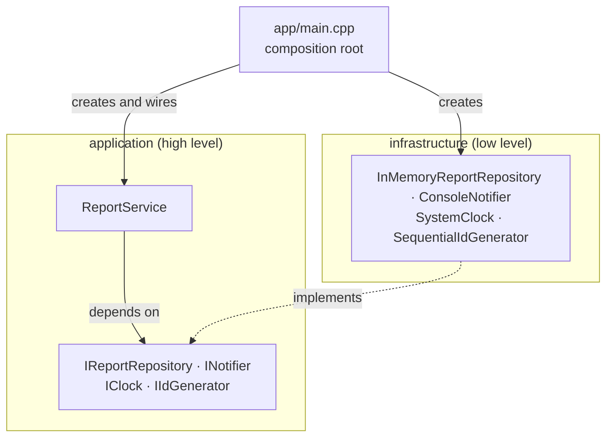

# TMPS — Laboratory Works

- **Course:** Software Design Techniques and Mechanisms (TMPS)
- **Author:** Eftode Andrei, FAF-242
- **Professor:** Istrati D.

One project grows through the whole course. Each laboratory work adds a section to this
report that says what changed in the code and which principle or pattern the change
applies. The state of the code at the end of each laboratory work is tagged in git
(`lab-1`, and so on), so every stage can be checked out and built on its own.

| Laboratory work | Topic | Tag |
| --- | --- | --- |
| [1](#laboratory-work-1--solid-principles) | SOLID principles: SRP, OCP, DIP | `lab-1` |

## The project: CivicDesk

CivicDesk is the backend of a civic issue reporting system. A citizen reports an urban
problem (a pothole, a broken street light, dumped garbage) with a category, a description
and a location, and city hall handles the report until it is resolved or rejected.

The domain comes from Aici, a civic issue reporting web application I worked on. CivicDesk
is a new C++ code base written for this course. The interface is a console demo on
purpose: the subject of the course is how the code behind it is designed.

What the system does at this stage:

- accepts a report after checking it against a set of validation rules
- recognises a report that repeats an open one of the same category within 25 m
- moves a report through its lifecycle (New, In progress, Resolved, Rejected) and refuses
  moves the lifecycle forbids
- requires a reason for every rejection, because the citizen sees it
- computes the 30 day deadline city hall has for answering each report
- searches reports by any combination of conditions
- announces every accepted report and every status change

## Building and running

The project needs a C++20 compiler, CMake 3.20 or newer and Ninja. It is developed and
tested with GCC 16.2 (MinGW-w64) on Windows. On Windows one command installs all three:

```
winget install BrechtSanders.WinLibs.POSIX.UCRT
```

Build, test and run:

```
cmake --preset default
cmake --build --preset default
ctest --preset default
./build/civicdesk
```

The `strict` preset does the same with warnings treated as errors (`-Wall -Wextra
-Wpedantic -Wconversion -Wshadow`). The code builds clean under it.

The unit tests use [doctest](https://github.com/doctest/doctest), a single header kept in
`third_party/`, so nothing is downloaded during the build.

## Project layout

```
app/main.cpp            composition root and console demo
src/
  domain/               Report, Status, Category, GeoPoint, DeadlineCalculator
  validation/           ReportValidator, IValidationRule
    rules/              one class per validation rule
  specification/        IReportSpecification and the search conditions
  application/          ReportService, the use cases
    ports/              the interfaces the service depends on
  infrastructure/       implementations of the ports: memory, console, system clock
  presentation/         ReportFormatter
  support/              small helpers
tests/                  unit tests, grouped like src/
third_party/doctest/    the test framework
```

Dependencies point one way: `infrastructure` and `presentation` know `application` and
`domain`, and never the other way round.

---

## Laboratory work 1 — SOLID principles

### Objectives

1. Study the SOLID principles.
2. Choose a domain and start a project in it.
3. Implement three SOLID principles in the project.

The three principles implemented are the **Single Responsibility Principle**, the
**Open/Closed Principle** and the **Dependency Inversion Principle**.

### 1. Single Responsibility Principle

> A class should have only one reason to change.

Without this principle the whole program would fit in one class:

```cpp
class ReportManager {
    void submit(...);          // checks the input, builds the report,
                               // pushes it into a vector, prints to the console
    void changeStatus(...);    // checks the lifecycle, updates, prints
    int  daysLeft(...);        // knows the legal term
    void printAll();           // knows the layout of the table
    std::vector<Report> reports_;
};
```

That class changes when the validation rules change, when the storage changes, when the
law changes the term, when the table gets a new column. Four unrelated reasons, and every
one of them puts the other three at risk.

In CivicDesk each of those reasons has its own class:

| Class | Its one job | The only reason it changes |
| --- | --- | --- |
| `Report` | the state of one report and its lifecycle | the lifecycle of a report changes |
| `ReportValidator` and the rules | decide whether a draft is acceptable | the conditions for accepting a report change |
| `DeadlineCalculator` | by when city hall has to answer | the legal term changes |
| `InMemoryReportRepository` | keep the reports | the storage changes |
| `ConsoleNotifier` | announce what happened | the way of announcing changes |
| `ReportFormatter` | turn a report into text for a person | the wording or the layout changes |
| `ReportService` | the order of the steps in each use case | the workflow changes |

`Report` shows the principle best by what it leaves out. It holds its data and guards its
lifecycle, and it has no `validate()`, no `save()` and no `print()`
([src/domain/Report.hpp](src/domain/Report.hpp)):

```cpp
class Report {
public:
    Report(ReportId id, Category category, std::string description, GeoPoint location, TimePoint createdAt);

    [[nodiscard]] Status status() const noexcept { return status_; }
    [[nodiscard]] bool isOpen() const noexcept { return !isClosed(status_); }

    /// Moves the report to another status.
    /// @throws InvalidStatusTransition if the lifecycle doesn't allow the move.
    void transitionTo(Status next);
    // ...
};
```

`ReportService` is the coordinator. Its `submit` reads like the list of steps, and every
step is one call to the class that owns it
([src/application/ReportService.cpp](src/application/ReportService.cpp)):

```cpp
SubmissionResult ReportService::submit(const ReportDraft& draft) {
    const ValidationResult validation = validator_.validate(draft);
    if (!validation.ok()) {
        return SubmissionResult{.report = std::nullopt, .errors = validation.errors()};
    }

    Report report{ids_.next(), draft.category, draft.description, draft.location, clock_.now()};
    repository_.save(report);
    notifier_.reportSubmitted(report);

    return SubmissionResult{.report = std::move(report), .errors = {}};
}
```

The 30 day term is a good example of a responsibility that is easy to miss. It could have
been a method of `Report` or a few lines in the formatter. As a class of its own,
`DeadlineCalculator` is the only place that changes if the term becomes 15 days or starts
counting working days, and it is tested without creating a service or a repository.

### 2. Open/Closed Principle

> Software entities should be open for extension and closed for modification.

The project has two places where new behaviour is expected often, and each one has an
interface as its extension point.

**Validation rules.** The naive validator is a function with a chain of `if` statements,
and every new condition means editing that function again. Here the validator knows only
an interface ([src/validation/IValidationRule.hpp](src/validation/IValidationRule.hpp)):

```cpp
class IValidationRule {
public:
    virtual ~IValidationRule() = default;
    virtual void check(const ReportDraft& draft, ValidationResult& result) const = 0;
};
```

and its whole logic is a loop over whatever rules it was given
([src/validation/ReportValidator.cpp](src/validation/ReportValidator.cpp)):

```cpp
ValidationResult ReportValidator::validate(const ReportDraft& draft) const {
    ValidationResult result;
    for (const auto& rule : rules_) {
        rule->check(draft, result);
    }
    return result;
}
```

A new rule is a new class in `src/validation/rules/` and one line in the composition root.
`ReportValidator` and the three existing rules (`ServiceAreaRule`, `DescriptionLengthRule`,
`DescriptionRequiredRule`) are not opened.

The tests prove it. `tests/test_validation.cpp` defines a rule that exists nowhere in
`src/`, `NoShoutingRule`, which refuses a description written only in capital letters. The
validator runs it like any other rule:

```cpp
TEST_CASE("a rule the validator has never heard of plugs in without changing it (OCP)") {
    ReportValidator validator;
    validator.addRule(std::make_unique<ServiceAreaRule>(kMoldova)).addRule(std::make_unique<NoShoutingRule>());

    ReportDraft draft = potholeDraft();
    CHECK(validator.validate(draft).ok());

    draft.description = "FIX THIS NOW";
    const ValidationResult result = validator.validate(draft);
    REQUIRE(result.errors().size() == 1);
    CHECK(result.errors().front() == "Please don't write the description in capital letters only.");
}
```

**Search conditions.** A repository usually grows one method for every question somebody
asks: `findByCategory`, `findByStatus`, `findOpenNear` and so on, and each of them changes
the interface and every class that implements it. Here the repository has a single query
method, and the question is an object
([src/specification/IReportSpecification.hpp](src/specification/IReportSpecification.hpp)):

```cpp
class IReportSpecification {
public:
    virtual ~IReportSpecification() = default;
    [[nodiscard]] virtual bool isSatisfiedBy(const Report& report) const = 0;
};

// in IReportRepository:
[[nodiscard]] virtual std::vector<Report> findAll(const IReportSpecification& specification) const = 0;
```

The conditions written so far are `AnyReport`, `HasCategory`, `HasStatus`, `IsOpen` and
`WithinRadius`, and `AllOf` combines any of them with a logical AND. The duplicate check
is a new feature built only by combining existing parts, with no change to the repository
([src/application/ReportService.cpp](src/application/ReportService.cpp)):

```cpp
std::vector<Report> ReportService::possibleDuplicates(const ReportDraft& draft) const {
    AllOf sameProblemNearby;
    sameProblemNearby.add(std::make_unique<HasCategory>(draft.category))
        .add(std::make_unique<IsOpen>())
        .add(std::make_unique<WithinRadius>(draft.location, kDuplicateRadiusMeters));

    return repository_.findAll(sameProblemNearby);
}
```

### 3. Dependency Inversion Principle

> High-level modules should not depend on low-level modules. Both should depend on
> abstractions.

`ReportService` is the high-level policy of the program: what happens when a report is
submitted or its status changes. Storage, console output, the system clock and the way
ids are made are low-level details. Written the direct way, the service would create an
`InMemoryReportRepository`, write to `std::cout` and call `system_clock::now()` itself,
and it could not be used or tested without them.

The dependency is inverted with four interfaces that belong to the application layer
([src/application/ports/](src/application/ports/)):

| Interface | What the service needs | Implementation used by the program |
| --- | --- | --- |
| `IReportRepository` | to store and find reports | `InMemoryReportRepository` |
| `INotifier` | to announce an event | `ConsoleNotifier` |
| `IClock` | the current time | `SystemClock` |
| `IIdGenerator` | a fresh id | `SequentialIdGenerator` |

The service receives them through its constructor and never names a concrete class
([src/application/ReportService.hpp](src/application/ReportService.hpp)):

```cpp
ReportService(IReportRepository& repository,
              INotifier& notifier,
              const ReportValidator& validator,
              const IClock& clock,
              IIdGenerator& ids) noexcept;
```

The source code dependencies now point from the details towards the policy:



The concrete classes are named in exactly one place, the composition root
([app/main.cpp](app/main.cpp)):

```cpp
InMemoryReportRepository repository;
ConsoleNotifier notifier{std::cout};
SystemClock clock;
SequentialIdGenerator ids{"R"};
ReportService service{repository, notifier, validator, clock, ids};
```

The tests wire the same service with other implementations: a clock that stands still and
a notifier that remembers its calls
([tests/test_report_service.cpp](tests/test_report_service.cpp)):

```cpp
struct ServiceFixture {
    InMemoryReportRepository repository;
    RecordingNotifier notifier;
    ReportValidator validator;
    FixedClock clock{at(2026, 10, 1, 9)};
    SequentialIdGenerator ids{"T"};
    ReportService service{repository, notifier, validator, clock, ids};

    ServiceFixture() { validator.addRule(std::make_unique<ServiceAreaRule>(kMoldova)); }
    // ...
};
```

This is what makes a test like "the creation time comes from the injected clock" possible.
It sets the clock to 15 January 2030 and checks that the new report carries that exact
moment, which cannot be done against the real clock.

`ReportService` does take `ReportValidator` as a concrete class. That is deliberate: the
validator is part of the policy, not a detail, and the part of it that varies is already
behind `IValidationRule`.

### How the principles support each other

The three principles were not applied in three separate corners of the code. SRP split
the program into small classes, and that is what made it possible to put interfaces
between them. DIP put the interfaces on the side of the service, so the details became
replaceable. OCP then used the same kind of interface to let rules and search conditions
be added from outside.

The Liskov Substitution and Interface Segregation principles were not the subject of this
laboratory work and are not claimed here.

### Results

The demo program runs one scenario through the whole system:

```
CivicDesk - civic issue reporting backend

== 1. Citizens submit reports ==
[notify] R-0001 received: Pothole
  accepted as R-0001
[notify] R-0002 received: Street light
  accepted as R-0002
[notify] R-0003 received: Garbage
  accepted as R-0003

== 2. An invalid draft is refused, with every reason listed ==
  refused:
    - The location is outside the service area.
    - A report in the category "Other" needs a description.

== 3. A repeated report is recognised before it is sent ==
  same problem as R-0001: Deep pothole in front of the bus stop

== 4. City hall handles the reports ==
[notify] R-0001: New -> In progress ("A repair crew comes on Monday")
[notify] R-0001: In progress -> Resolved
  R-0003 -> Rejected refused: A rejection needs a reason. The citizen sees it.
[notify] R-0003: New -> Rejected ("The land is private property")
  R-0001 -> In progress refused: A report can't go from "Resolved" to "In progress".
  R-0042 -> Resolved refused: There is no report with the id R-0042.

== 5. Every report ==
  R-0001  Pothole       Resolved     closed                        Deep pothole in front of the bus stop
  R-0002  Street light  New          due 2026-10-31, 30 days left  The street light has been off for a week
  R-0003  Garbage       Rejected     closed                        Garbage dumped next to the playground

== 6. Reports still waiting for city hall ==
  R-0002  Street light  New          due 2026-10-31, 30 days left  The street light has been off for a week
```

The unit tests cover the domain, the validation rules, the specifications, the service,
the infrastructure and the formatter:

```
[doctest] test cases:  58 |  58 passed | 0 failed | 0 skipped
[doctest] assertions: 173 | 173 passed | 0 failed |
[doctest] Status: SUCCESS!
```

### Conclusions

The three principles turned out to be three views of the same idea: decide what is likely
to change, and keep it apart from what is not.

SRP was the one that shaped the code most. Once every class had one job, the other two
principles had somewhere to attach. The clearest sign that the split is right is in the
tests: the deadline, the validation rules and the lifecycle are each tested alone, in a few
lines, with no setup of the rest of the system.

OCP paid off inside the laboratory work itself. The duplicate check was added after the
repository was written, and it needed no change to the repository, only a new combination
of specifications. The principle is worth applying where change is expected, though.
Validation rules and search conditions change often, so they got an extension point. The
lifecycle of a report is still a plain function, because nothing asked for more.

DIP is what made the service testable. With the clock, the storage and the notifier behind
interfaces, 58 test cases run in a few seconds without printing a line or depending on
the date. The same property means that moving the reports to a file or a database later
is one new class and one changed line in `main.cpp`.

The price is more files and more indirection than the program strictly needs at this
size: a reader has to follow an interface to find what really runs. For a project that
will keep growing through the next laboratory works, that price is paid once and the
structure is already in place for what comes next.
